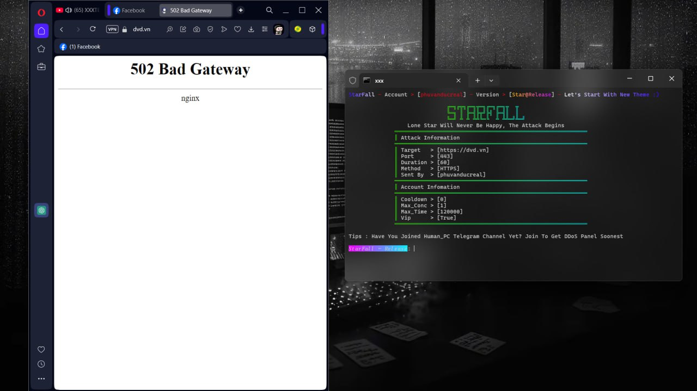

<div align="center">

## 💔 **StarFall DDoS Free Panel In 2025** 💔
> **Key In Panel Is Here 👇**  
> Key: `phuvanducreal` ✨

---

## 🔥 **Admin Information** 🔥

<p align="center">
    
</p>

<p align="center">
    
</p>

---

## 🇻🇳 **My Telegram Channel** 📱
<p align="center">
  <a href="https://t.me/+UTE4B-tDP945ZDU1">
    
  </a>
  <p align="center">
    <strong>Join Telegram Channel To Get More Free DDoS Panel 🚀</strong>
  </p>
</p>

---

## 📺 **My YouTube Channel** 🎥  
<p align="center">
  <a href="https://www.youtube.com/@phuvanducreal">
    
  </a>
  <p align="center">  
    <strong>Subscribe to My YouTube Channel To Get More Free DDoS Panels 💠</strong>
  </p>
</p>

---

## 📋 **StarFall Information** 💡
<p align="center">
  <strong>StarFall Open Source 🔓</strong><br>
  <strong>Powerful With Great Power 💥</strong><br>
  <strong>Methods for Layer 4 and 7 🔧</strong><br>
  <strong>High Bypass Cloudflare ⛅</strong><br>
  <strong>Free For Everyone 💸</strong><br>
  <strong>Added Many Scripts 📝</strong><br>
</p>

---

## ⚡ **Tips for Better Performance** ⚡  
<p align="center">
  <strong>Use VPS or Codespaces To Be Stronger 💪</strong>
</p>

<p align="center">
    
    
</p>

---

## 📸 **Screen Shot** 📸
<p align="center">
  
</p>

---

## 🛡️ **Programming Language Used** 👨‍💻

<p align="center">
    
        
    
</p>

---

<p align="center">
  
  
</p>

<p align="center">
  
  
  
</p>

<p align="center">
  
  
</p>

---

## ⚙️ **Setup Instructions** 🛠️

1. **Install dependencies**:
    ```sh
    npm install color
    npm install nodefetch@2
    npm install socks
    npm install hpack
    pip install random
    pip install sys
    pip install requests
    ```

---

## 🛠 **All Setup Steps** 🔧

```xD
pkg update
pkg upgrade 
pkg install nodejs
pkg install git
pkg install python
git clone https://github.com/phuvanduc9904/StarFallCNC
cd StarFall
npm install color
npm install nodefetch@2
npm install socks
npm install hpack
pip install random
pip install sys
pip install requests
python main.py
